# Visual Inertial Odometry 

Die Anwendungsmöglichkeiten von Visual Inertial Odometry (VIO) sind vielfältig und zeichnen sich eigentlich immer dadurch aus, dass ein mechanisches Messen der Distanz (z.B. mit Wheel-Encodern) nicht möglich ist.  
Einige sinnvolle Einsatzbereiche umfassen:  
- Drohnen, die in Echtzeit ihre Rotation kennen und Lücken zwischen GPS-Updates überbrücken müssen. 
- Feuerwehrleute und Rettungskräfte, die in unbekannten Gebäuden akkurat lokalisiert werden müssen.
- Autonome Fahrzeuge, die auf losem Boden (z.B. Sand) fahren, bei dem die Encoder-Werte durch das Durchdrehen der Reifen abgefälscht werden. 
- ...

In dieser Projektbeschreibung gehe ich darauf ein, wie ich im Rahmen der Lehrveranstaltung "Datenfusion" eine prototypische Umsetzung einer Lokalisation mit Visual Inertial Odometry implementiert habe.  
Damit sich die Notebooks und die für den PC gedachten Skripte ausführen lassen, müssen die Daten erst von [diesem Onedrive](https://technischehochschulen-my.sharepoint.com/:f:/g/personal/sternbergro87782_technischehochschulen_onmicrosoft_com/EiLzEMuVNSJIpBsdpvRN09cB-_JZaFlgGCEvAKqo56BtPg?e=VzGadr) heruntergeladen und entpackt werden. Dort befinden sich auch die Demo-Videos.

# 1 - Hardware

## Arduino Nano 33 BLE Sense Lite (TinyML Kit Harvard)

Arduino mit Onboard LSM9DS1 Inertial Measurement Unit.

## Puzzlebot von Manchester Robotics mit Nvidia Jetson und Raspi v2 Kamera

Der Projektstart lief leider nicht wie geplant und hat sich aufgrund von technischen Startschwierigkeiten um mehrere Wochen nach hinten verschoben. Grund dafür war das Einrichten des Puzzlebots von Manchester Robotics. 
Aktuelle Linux-Images waren erst auf Anfrage des Dozenten Cristian Axenie verfügbar und durch die Änderungen ist der Großteil der mitgelieferten Dokumentation obsolet. Zusätzlich fehlte bei den Puzzlebots benötigte Adapter (z.B. WLAN).

Der Puzzlebot von Manchester Robotics ist ein Bildungs- und Prototyping-Tool. Der Roboter besteht aus mehreren Komponenten, die ich hier nur sehr kurz beschreibe:
- Hackerboard; kleiner Mikrocontroller, der z.B. die Motoren ansteuert (in diesem Projekt nicht von Relevanz)
- Nvidia Jetson Nano 4GB
    - Mini-Computer; Linux-fähig. Image von Manchester Robotics (auf Anfrage) mitgeliefert.
    - Hier läuft die gesamte Datensammlung.

### Puzzlebot Anpassungen

Im Rahmen des Projekts habe ich mehrere Änderungen am Hardware-Setup des Puzzlebots vorgenommen.
- Radar abgebaut


- **IMU an der Stelle des Radars**  
    Die IMU ist - wie noch gezeigt wird - sehr anfällig für Erschütterungen. Deswegen habe ich mich dazu entschieden den Arduino nocht mit Schrauben zu befestigen. Stattdessen ist er mit einer Schaumstoffschicht leicht gefedert und mit Kabelbindern am Puzzlebot fixiert. Den genauen Aufbau kann man den Bildern entnehmen.

    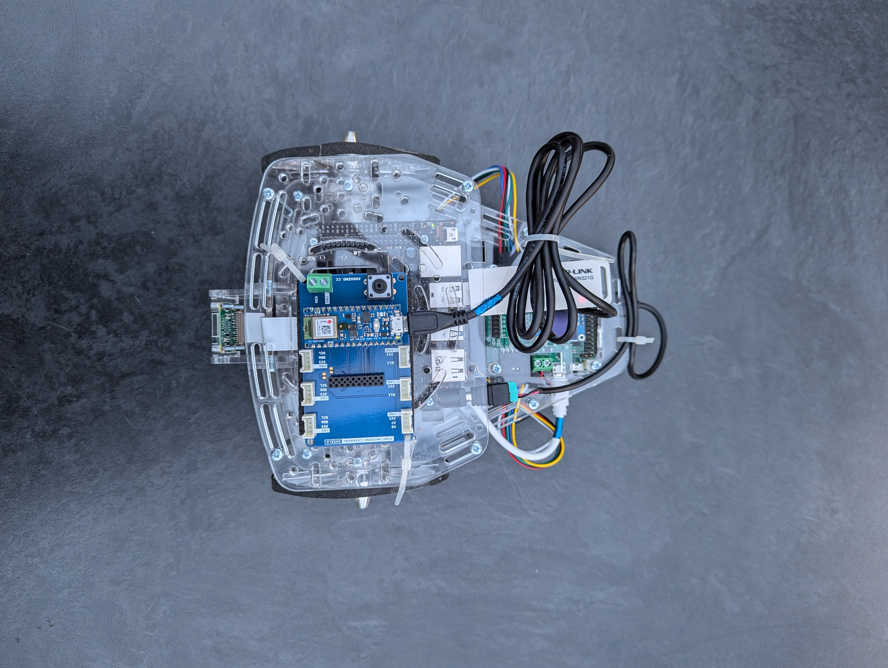
    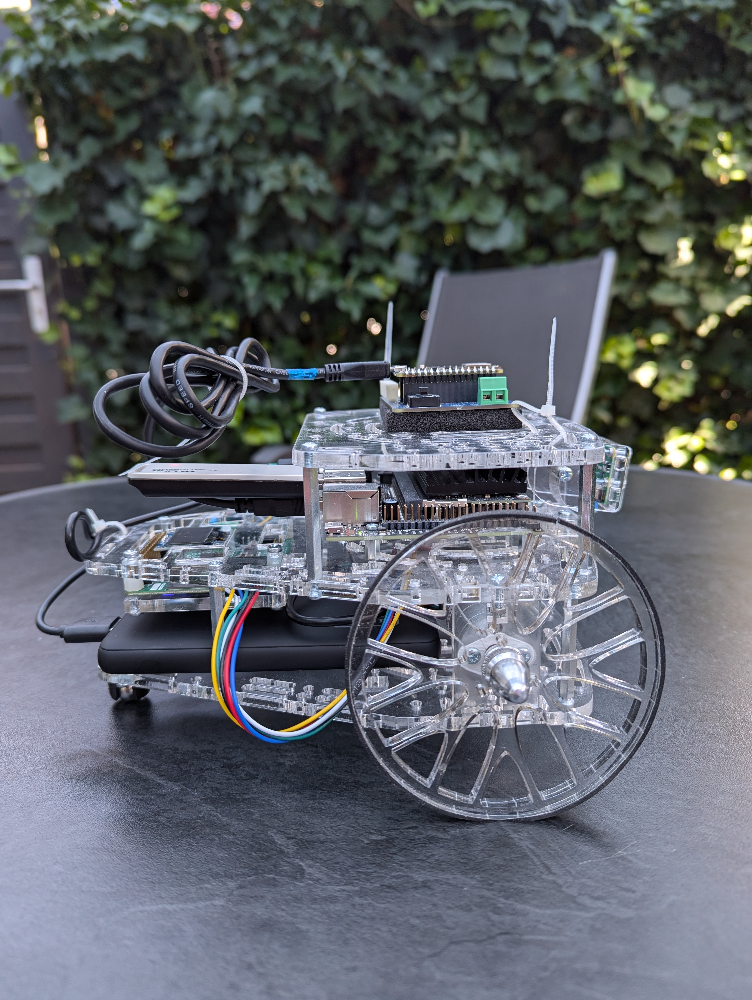

- **Barrel Jack Power Supply Jetson**  
    Alle Projektgruppen, die mit dem Puzzlebot gearbeitet haben, haben festgestellt, dass der Jetson spätestens bei der Nutzung von Maus, Tastatur und Bildschirm Probleme mit dem Stromzufuhr hat. Die Warnung ist dann "System throttled due to Over-Current.", was leider eine falsche Fehlermeldung ist, wie [hier](https://forums.developer.nvidia.com/t/system-throttled-due-to-over-current/158055) beschrieben. Das Problem ist nicht Over-current, sondern Under-voltage.  
    Eine Lösung für dieses Problem ist eine alternative Art der Stromzufuhr. Statt den Jetson über Mikro-USB mit Strom zu versorgen, kann man diesen auch über einen Barrel-Jack (Hohlstecker) anschließen. Zuhause habe ich kein USB auf Barrel-Jack (5.5mm OD / 2.1mm ID) Kabel gefunden, aber die Adapter sind für unter einem Euro pro Stück online zu haben.  
    Ich habe also ein altes Mikro-USB-Kabel (davon hat man eh zu viele) abisoliert und die Kabel in die dafür vorgesehenen Schraubklemmen gesteckt. Durch eine Google-Suche habe ich aber noch gesehen, dass jemand seinen Jetson durch eine ähnliche Aktion schon einmal wegen falscher Stromrichtung zerstört hat. Bei Barrel-Jacks gibt es wohl auch einige Bauteile, bei denen der innere Pin negativ ist. Beim Jetson muss der innere Pin aber positiv sein.  
    Um das zu überprüfen habe ich ein Multimeter genutzt. Das ist zwar nicht schwer, ich habe es aber zum ersten Mal gemacht und musste das auch erst per [Youtube Video](https://www.youtube.com/watch?v=5DBTNplNTfA) lernen.  
    Im Endeffekt war das Bauteil standardmäßig mit dem Jetson kompatibel und der Stromfluss war in der richtigen Richtung. Ansonsten hätte ich einfach das rote und schwarze Kabel tauschen müssen.
    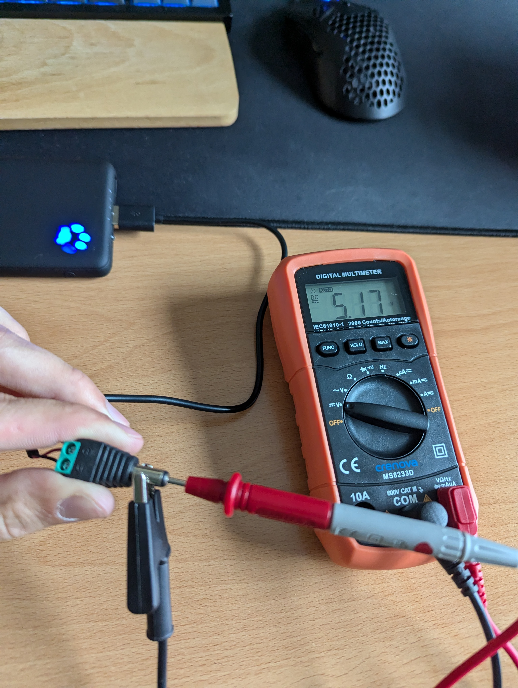 


# 2 - Datenbeschaffung

Für Visual Inertial Odometry benötigt man die beiden im Namen enthaltenen Sensordaten. Das umfasst die Kamerabilder, sowie die Messungen der Inertial Measurement Unit (9DoF). 

## Kameradaten

Als Kamera ist im Puzzlebot die Raspberry Pi Kamera v2 verbaut. Den Videostream daraus kriegt man über Gstreamer mit Nvidia Argus über OpenCV VideoStream in Python. Der Befehl ist dann etwas länger und sieht so aus: 

```
nvarguscamerasrc sensor-id=0 ! video/x-raw(memory:NVMM), width=(int)1920, height=(int)1080, framerate=(fraction)30/1 ! nvvidconv flip-method=2 ! video/x-raw, width=(int)1280, height=(int)720, format=(string)BGRx ! videoconvert ! video/x-raw, format=(string)BGR ! appsink
```
Darin sind alle nötigen Formatspezifikationen enthalten. Framerate, Auflösung, Farbformat etc.   

Den übergibt man diesen String im Konstruktor vom cv2.VideoCapture Objekt und kann danach mit videcapture.read() die aktuellen Frames einlesen. Ein Skript zum Video zeigen habe ich von Jetsonhacks [hier](https://github.com/JetsonHacksNano/CSI-Camera) und dann abgeändert, um die einzelnen Frames abzuändern. Auch mit Headless-Funktionalität, damit das Skript auch über SSH funktioniert. X11 Forwarding habe ich auch ausprobiert, das hat aber viel zu stark nachgehangen. Vermutlich ist der WLAN-Stick dafür zu schwach. Allgemein hatte ich leider bei Verbindung über SSH oft Verbindungsabbrüche.
Das Skript ist [hier](./code/pure_visual_odometry/camera_data_collection.py).


## Inertial-Measurement-Unit-Daten

Um die IMU-Daten vom Arduino in Python nutzbar zu machen, habe ich ein eigenes Programm für den Arduino geschrieben, das die Daten effizient in Bytes auf Serial legt. Viele Beispiele, die man online zu ähnlichen Setups findet schreiben die Daten als String auf Serial, was zwar lesbar ist, aber Bandbreite raubt.

Die .ino-Datei ist [hier](./code/visual_inertial_odometry/IMU_Arduino_source/IMU_Arduino_source.ino) abgespeichert.

Zur Datenbeschaffung in Python und zu ersten Problemen mit der IMU gibt es das Notebook [imu_data](./code/visual_inertial_odometry/notebooks/imu_data.ipynb). In eigentlich jeder Verarbeitung der Daten bilde ich zuerst den Mittelwert der letzten x Messungen (x kann variieren), um grobe Messungenauigkeiten etwas auszubügeln. 


# 3 - Visual Odometry

## Kalibrierung

Um durch visuelle Odometrie sinnvolle Daten zu erhalten, muss man die intrinsischen Parameter der Kamera wissen. Das ist z.B. die Brennweite der Linse. Das Herausfinden dieser Parameter ist die Kalibrierung der Kamera. Die gängigste Methode dafür, ist es ein Schachbrettmuster auszudrucken und aus mehreren Bildern mit diesem Schachbrettmuster die Parameter zu errechnen.  
Dafür habe ich ein Kalibrierungsskript aus [diesem Github](https://github.com/smidm/video2calibration) genutzt.  
Das für den Puzzlebot lauffertige Skript mit Raspi-Cam-Videostream ist [hier](./code/pure_visual_odometry/bot_files/).

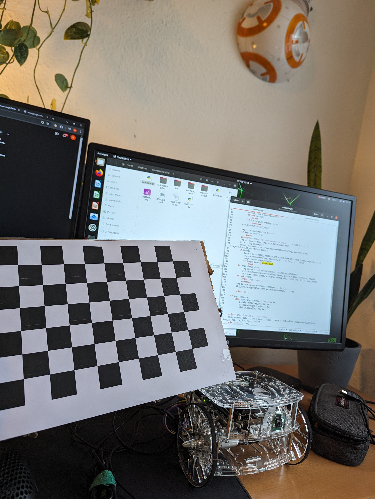


## Skript

Ich habe etwas suchen müssen, bis ich eine brauchbare Implementierung von visueller Odometrie gefunden habe. In diesem [Github Repository](https://github.com/uoip/monoVO-python/blob/master/visual_odometry.py) mit dazugehörigem Project-Report [hier](https://avisingh599.github.io/assets/ugp2-report.pdf) ist eine VO-Pipeline in nur 100 Zeilen Python implementiert. Das hatte den Vorteil, dass ich mich hier mit den Konzepten beschäftigen konnte und nicht durch eine eventuell bessere, aber deutlich unverständlichere Implementierung den Überblick verliere.  


### Probleme für unseren Use Case

##### Kein Ground Truth

Die Implementierung aus dem Repository funktioniert deswegen sehr gut, weil sie in jedem Update-Schritt auf die absolut gefahrene Distanz (aus dem KITTI-Datensatz) zurückgreift. Das bedeutet, sie liest in der Methode `getAbsoluteScale` aus, wie weit sich das Fahrzeug bewegt hat. Da man bei dieser Art Implementierung von Visual Odometry über die Opencv-Funktionen `findEssentialMat(...)`  und `recoverpose(E,...)` nur einen Einheitsvektor mit der Richtung der Translation erhält, ist das auch notwendig, um die Positionsupdates zu skalieren.  
In diesem Projekt habe ich aber keine Ground Truth. Ich weiß eben nicht, wie weit der Roboter zwischen den Frames gefahren ist. Meine einzige Möglichkeit diesen Algorithmus anzuwenden, ist es also die Bewegung zwischen den Frames mit einer von der IMU gemessenen Entfernung zu skalieren. 

#### Kamera und Lichtverhältnisse

Visual Odometry funktioniert in Außenbereichen deutlich besser, als in Innenbereichen. Draußen gibt es einfach deutlich mehr und deutlich leichter erkennbare Features. Außerdem sieht man in Außenbereichen meistens etwas weiter, was dazu führt, dass Features im Bildhintergrund über mehrere Frames bestehen bleiben und Noise aus den Bildrändern kompensieren können.  

Ein weiteres Problem in Innenbereichen sind die schlechteren Lichtverhältnisse. Die Kamerabilder verwackeln durch die längere Belichtungszeit leichter, was die Featuredetection noch fehleranfälliger macht. Mit Bildern aus Innenbereichen ist der Algorithmus langsamer und ist öfter abgestürzt. Das lag daran, dass bei sehr verwackelten Bildern teilweise zwischen den Frames nur 4 Features wiedererkannt wurden. Das hat die Berechnung der EssentialMatrix unmöglich gemacht und das Programm ist abgestürzt. Letztendlich musste ich den Threshold für die Featuredetection deutlich nach unten schrauben. Dadurch ist zwar mehr Noise enthalten, aber das Programm läuft wenigstens durch.

### Anwendung des Skripts

Eine auf den Puzzlebot angepasste Anwendung des Skripts ist [hier](./code/pure_visual_odometry/vo_test.py) verfügbar. Das Problem der absoluten Translation wird dadurch ignoriert, dass angenommen wird, dass sich der Roboter zwischen jedem Frame genau gleich weit bewegt -> Faktor ist 1.  
Die Ergebnisse auf den von mir aufgenommenen Testserien reichen von miserabel bis semi okay. In Serie 28 wird z.B. eine Linkskurve gefahren und der Output ist hier zu sehen:   
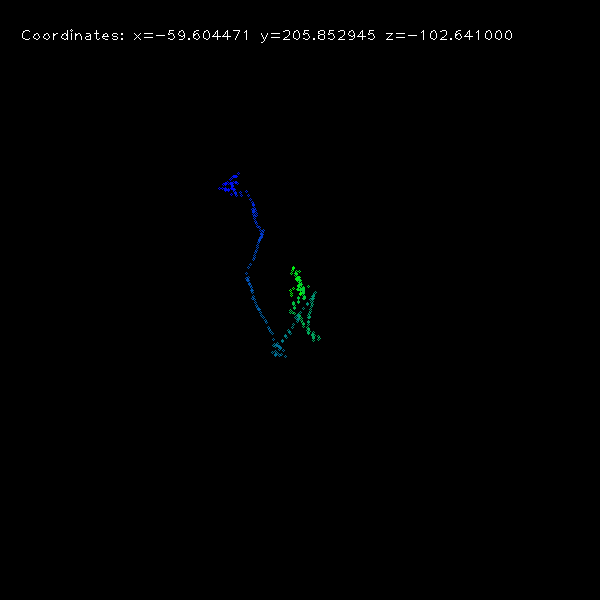  

Bei Serie 29 ist das Ergebnis besser ausgefallen, aber immernoch nicht brauchbar. Hier fährt der Roboter erst gerade aus, macht dann eine Wende (Linkskurve 180°) und fährt anschließend wieder geradeaus.  
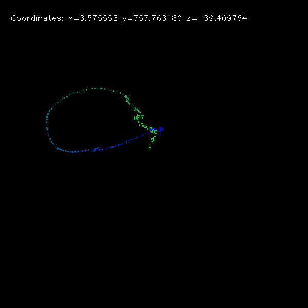   

Ein Hauptproblem ist, dass die der Translationsvektor und Rotationsmatrizen auch im Stillstand des Roboters angewendet werden, was zu einem wilden herumspringen im Startpunkt führt.

## Notebook

Wie aus zwei aufeinanderfolgenden Bildern Lokalisationsinformationen für Odometrie werden, ist in einem eigenen Notebook ([visual_odometry_fundamentals](./code/pure_visual_odometry/visual_odometry_fundamentals.ipynb)) zusammengefasst. Das Notebook dient dazu, dass Kommilitonen sich das Grundkonzept bei Interesse noch einmal ansehen können.


# 4 - Inertial Odometry

Der absolut schwerste Teil des Projektes war es, brauchbare Informationen aus den IMU-Daten zu extrahieren. Das hat mich auch insgesamt die meiste Zeit gekostet.


## Research
Am Anfang habe ich versucht mich erst einmal über IMUs schlau zu machen und [diese Blogserie](https://www.tangramvision.com/blog/learn-imu-fundamentals-part-1-of-5?_gl=1*m3vlne*_up*MQ) durchgearbeitet. Hinterher hatte ich zwar ein besseres Verständnis von Sensormodellen, aber wie man den Berg an Formeln jetzt implementieren und für mein Projekt verwenden kann, hat sich mir nicht erschlossen.
Vermutlich ist das auch der Sinn dieser Blogserie. Die ist nämlich von einer Firma, die zufälligerweise gleich die Lösung für dieses Problem anbietet und sonst selbst durch das Bereitstellen ihres Know-Hows dazu beitragen würde, dass sie weniger Kunden hat.  


## Kalibrieren
Direkt am Anfang ist mir aufgefallen, dass die Genauigkeit der IMU-Werte noch zu wünschen übrig lässt. Eine potentielle Lösung dafür ist die Kalibrierung.  
Die einfachste Art der Kalibrierung ist es, den Sensor einfach still stehen zu lassen und dann den Mittelwert der Messdimensionen zu bilden. Damit kann man den Offset dann ohne viel Aufwand entfernen. 
In meinem finalen Code, wird diese Art der Kalibrierung auch am Anfang jeder Messreihe ausgeführt, da sich der Offset leider immer wieder leicht ändert.  

Zusätzlich dazu kann man auch lineare Störfaktoren für die IMU-Achsen durch Kalibrieren beseitigen. Dafür habe ich eine abgeänderte Version der Arduino LSM9DS1-Library genutzt, die man [hier](https://github.com/FemmeVerbeek/Arduino_LSM9DS1) findet. Eine Anleitung zur Kalibrierung ist im Video [hier](https://www.youtube.com/watch?v=BLvYFXoP33o). Das Magnetometer habe ich erst nach der Installation auf dem Puzzlebot kalibriert, damit die Metallteile berücksichtigt werden, die das Magnetfeld beeinflussen.

Für die Kalibrierung soll die IMU in einer Box sein, damit man die IMU auch präzise auf alle 6 Seiten legen kann. Dafür Habe ich die IMU mit einem Faden in einer alte Verpackung eines Netzteils fixiert.

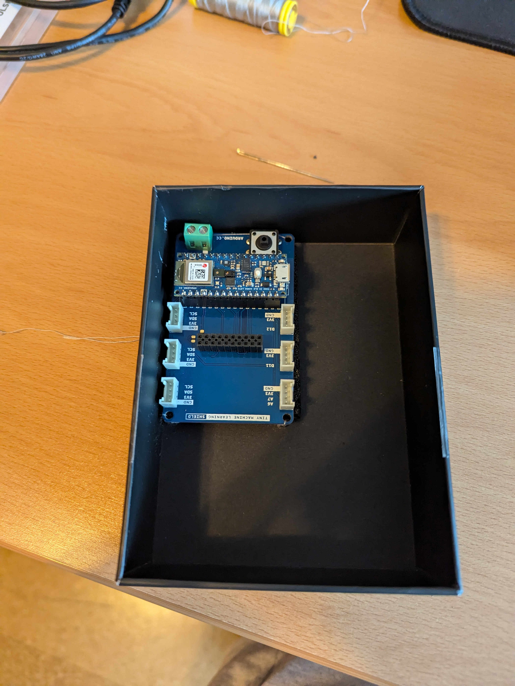
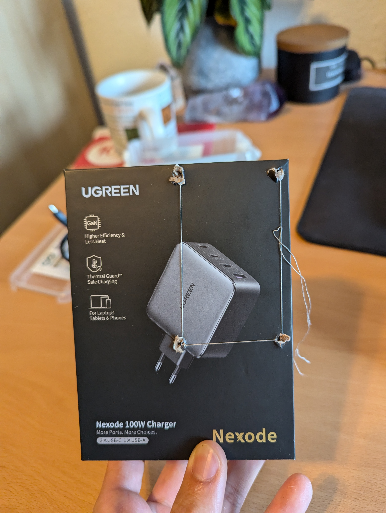

Die Konstanten fließen im [Arduino Code für die IMU](./code/visual_inertial_odometry/IMU_Arduino_source/IMU_Arduino_source.ino) mit ein. 

## Double Integration

Der einfachste Weg, um über die IMU an Positionsupdates zu gelangen, ist die doppelte Integration der Beschleunigungswerte. Bei abgetasteten und somit diskreten Daten bedeutet das einfach nur die Summe der Werte zu bilden und mit der Zeit den Werten zu multiplizieren. Das hat aber nur sehr schlecht funktioniert. Im Stillstand hat sich die IMU vermeintlicherweise (noch ohne Kalibrierung) mehrere Meter die Sekunde von der Stelle bewegt.  
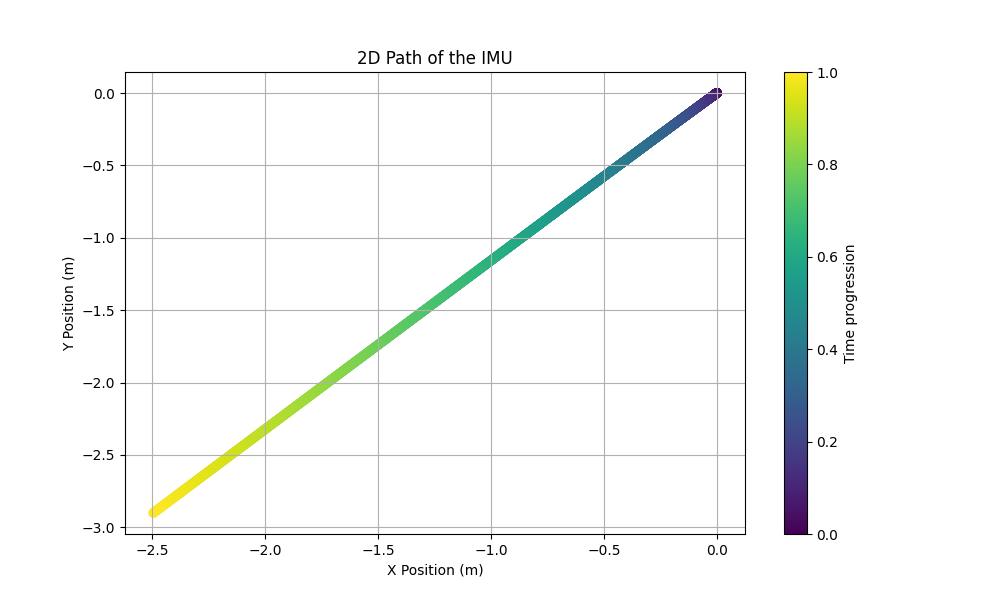

Mit Kalibrierung war das Problem um ein Vielfaches weniger dramatisch, aber trotzdem noch vorhanden.

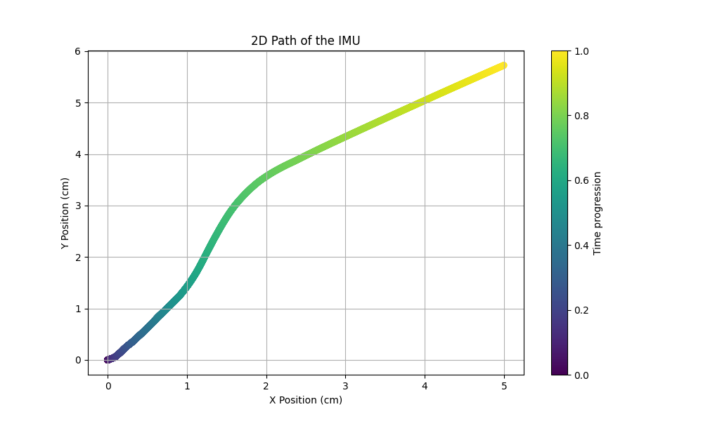

Was aber trotz Kalibrierung ein größeres Problem dargestellt hat, ist, dass das Integral der Beschleunigungen nach einer Bewegung nicht auf genau 0 zurückgekehrt ist. Das bedeutet, dass trotz Stillstand noch Beschleunigung, die a) noch übrig war oder b) zu viel beim Bremsen berechnet wurde im System verblieben ist.  

### Ansatz zur Verbesserung der Werte

- Abschneiden von allen Accelerometer-Werten unter einem Threshold.  
    - Annahme: Es handelt sich vermutlich um Noise
- Zurücksetzen der Geschwindigkeit, wenn sich diese in einem Zeitraum nicht geändert hat (lange keine neuen Acc-Daten)  
    Die dahinterliegende Annahme ist, dass das Accelerometer so viele Störungen mit einbezieht, dass bei jedem System, das sich in Bewegung befindet (trotz eventueller konstanter Geschwindigkeit) konstant `Accelerometer-Updates > Threshold`  auftauchen.

Die Parameter für diese beiden Ansätze zu finden, war mit viel Trial and Error verbunden.

Die Werte haben sich leider trotzdem auch als so unsicher herausgestellt, dass ich für das finale Skript nur die absolute Bewegung ohne Richtungsinformation genutzt habe.
    
## YAW

Da Visual Odometry eine Dead-Reckoning-Methodik ist, gibt es keine Möglichkeit, um Drift zu korrigieren. Da kommt die IMU ins Spiel. In einem [Video auf dem MATLAB Youtube-Kanal](https://www.youtube.com/watch?v=0rlvvYgmTvI&t=621s) ist beschreiben, wie man aus Accelerometer und Magnetometer die Rotation relativ zu Norden herausrechnet. Das geht über zwei Kreuzprodukte zwischen dem Erdanziehungsvektor (Acc) und den Magnetfeldmessungen (Mag). Das habe ich dann in Python implementiert und schon sinnvolle Daten herausbekommen. Die hatten aber ein paar Lücken. Deswegen habe ich einen Kalman Filter angewendet, um das Gyroskop miteinzubeziehen. Im Notebook [imu_yaw](./code/visual_inertial_odometry/notebooks/imu_yaw.ipynb) ist das Ganze näher beschrieben. Im Zuge dieser Berechnung konnte ich dann letztendlich den Beschleunigungsvektor ganz weglassen, da die IMU sowieso fest auf dem Puzzlebot verbaut ist und die Erdanziehung immer in die gleiche Richtung zeigt. Dadurch ergeben sich später keine Probleme mit der Yaw-Berechnung, falls der Puzzlebot beschleunigt.


## Skript mit Threading

[Skript](./code/visual_inertial_odometry/inertial_data_threaded.py)

Damit die IMU-Daten nicht nur mit der Framerate des Kamerastreams (30) verarbeitet werden, habe ich die oben beschriebenen Ansätze in einen eigenen Thread eingebaut. Der kann permanent die IMU-Werte abfragen und daraus Yaw und gefahrene Distanz berrechnen. Aus dem Kamera-Thread wird dann nur noch nach jedem Bild abgefragt: "Wie weit hat sich der Roboter seit dem letzten Bild bewegt" und das, ohne die Richtung der Bewegung miteinzubeziehen. Diese ist leider immer noch unzuverlässig. Am Ende ließen sich aus der IMU allerdings Werte extrahieren, die bei kleiner Translation deutlich niedriger, als bei hoher Translation sind und gleichzeitig bei Stilstand den Wert 0 annehmen. (Das sollte einfacher sein, als es ist...). Gut, dass das schon für die Fusion mit der visuellen Odometrie über den Scale-Faktor reicht. 

Das berechnete Yaw wird auch für jeden Frame vom Kamera-Thread abgefragt.


## Umweg Pypose

Pypose ist eine relativ neue Python Bibliothek, die z.B. einen IMU Integrator auf Basis eines Neuronalen Netzes bereitstellt. Die Ergebnisse damit waren deutlich besser, als alles, was ich mit normaler Doppelintegration geschafft habe. Und das ohne Training mit eigenen Ground-Truth-Daten von meiner IMU. Es gibt aber einen Haken. Die Nutzung ist viel zu rechenintensiv. Zwar könnte man die Berechnung durch Auslagerung auf die GPU nocheinmal deutlich beschleunigen, aber sie würde vermutlich trotzdem noch länger brauchen, als die Zeitspanne, die die Werte abdecken.

Solche Probleme findet man aber leider erst heraus, wenn man es schon zum Laufen gebracht hat, was durch das umständliche Interface über Pytorch-Datasets etwas gedauert hat.

Den Versuch findet man in [diesem Notebook](./code/visual_inertial_odometry/notebooks/pypose_double_integration.ipynb).


## Fazit IMU

Zur Heading Estimation ist die IMU durchaus brauchbar. Durch ein paar Annahmen, die ich in meinem Use-Case treffen kann, geht das auch mit vergleichsweise einfachen Mitteln. Es gibt auch deutlich bessere Verfahren, wie den Madgwick-Filter, der mir an vielen Stellen online begegnet ist, aber da ich mich auf eine 2D-Pose Estimation beschränke, war das gar nicht nötig.

Bei der Schätzung von Distanzen ist die IMU durch das störbehaftete Accelerometer leider nicht sonderlich gut geeignet. Es hat seinen Grund, warum reine Inertial Odometry eigentlich nirgends auf längere Distanzen eingesetzt wird.

# 5 - Fusing VO and IMU

## Data Gathering

[Data Gathering Skript](./code/visual_inertial_odometry/data_gathering.py)

Um Daten für die Tests der VIO-Implementation zu sammeln, habe ich den IMU-Thread mit der Kameradatensammlung verbunden. Das Skript ist in der aktuellen Form auf dem Roboter lauffähig und muss nur noch gestartet werden. Am Anfang muss der Roboter für ein paar Sekunden still stehen, bis die IMU kalibriert ist (neuer Offset). Wenn das um ist, kommt pro Frame eine Ausgabe, man sieht den Zeitpunkt also recht klar. Mit diesem Skript sind alle im Verzeichnis `data/recordings/` abgelegten Aufnahmen gemacht worden.

## Timing

Bevor die Daten aus der Visual Odometry mit den IMU-Daten fusioniert werden können, muss noch geklärt werden, ob die Daten einen zeitlichen Versatz haben. Das habe ich im [Timing Notebook](./code/visual_inertial_odometry/notebooks/timing.ipynb) gemacht. Herausgekommen ist, dass die IMU-Daten den Bilddaten um ca 12 Bildframes vorraus sind. In späteren Tests waren das teilweise auch nur 10 Frames. Ein bisschen Spielraum ist also nicht auszuschließen.


## Architektur Insgesamt

Wie schon angedeutet, braucht die im Projekt genutzte Implementierung von Visual Odometry einen Scale-Faktor, der von der IMU geliefert werden kann. Dieser wird also zu jedem Frame mit in das VIO-Update mit eingefügt.

Dazu haben wir über Magnetometer und Gyroskop eine Yaw-Schätzung. Diese wird mittels Complementary Filter mit dem von der Visual Odometry berechneten Yaw fusioniert. Wie das geht, steht im Notebook [vio_yaw_fusion](./code/visual_inertial_odometry/notebooks/vio_yaw_fusion.ipynb). Den Complementary Filter habe ich genutzt, weil er deutlich einfacher aufgebaut ist, als der Kalman Filter und ich auch eine weitere Variante für die Fusion ausprobieren wollte. 

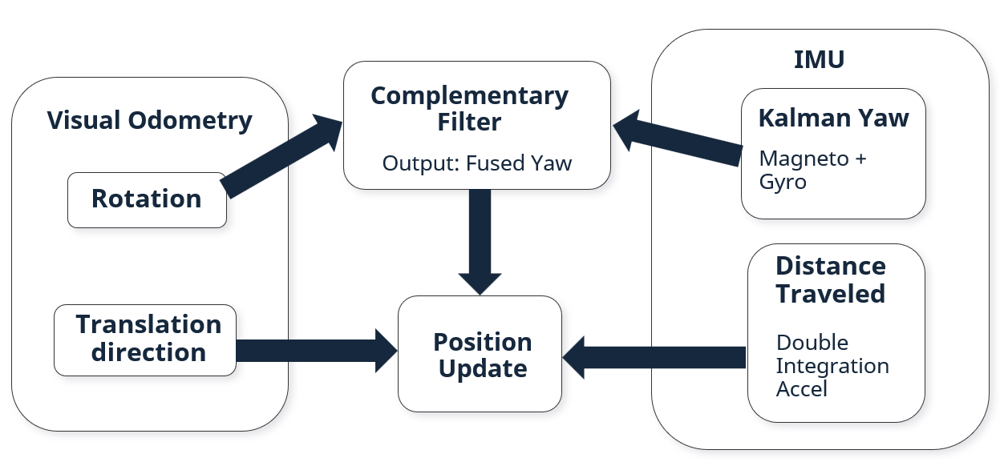

## Weitere Annahmen

Dadurch, dass der Roboter zwei Räder hat, ist exakt seitliche Translation mit 90° zur Fahrtrichtung fast ausgeschlossen. Aus diesem Grund habe ich in die VIO-Implementation einen Faktor eingebaut, der die seitliche Translation bestraft. Dieser wird mit der dazugehörigen Komponente des Vektors multipliziert, wonach der Translationsvektor wieder zum Einheitsvektor umgewandelt wird. 


## Fertige VIO-Implementation

Die Fertige VIO-Implementation ist in [diesem Skript hier](./code/visual_inertial_odometry/visual_inertial_odometry.py) zu finden. Einen Test mit den vom Puzzlebot aufgenommenen Daten kann [hier](./code/visual_inertial_odometry/VIO_test.py) durchgeführt werden. Im Test-Skript kann man auch weiter auch mit den Parametern experimentieren.

## Tests

Anmerkungen:
- Bei Start zeigen die Roboter in der Visualisierung nach unten.


### Vorwärts -> Rechtskurve

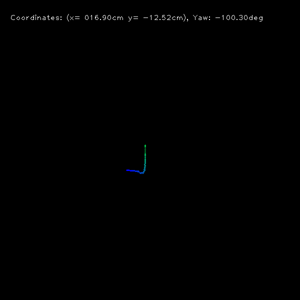  

Die Anwendung auf diese Serie funktioniert ganz in Ordnung. Wenn man sich die Bildserie genauer ansieht, fallen einem aber trotzdem Unterschiede auf.  


### Rechtskurve mit vorigem Schlenker nach links

#### Mit Priors
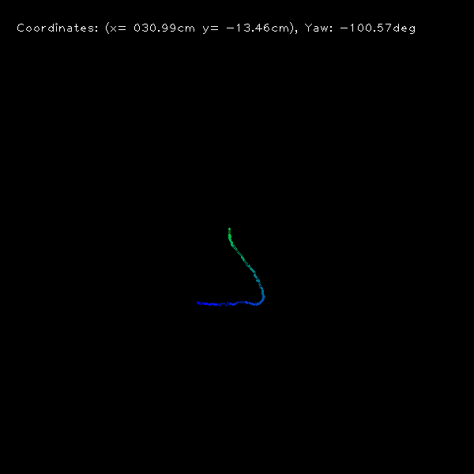  


#### Ohne Priors
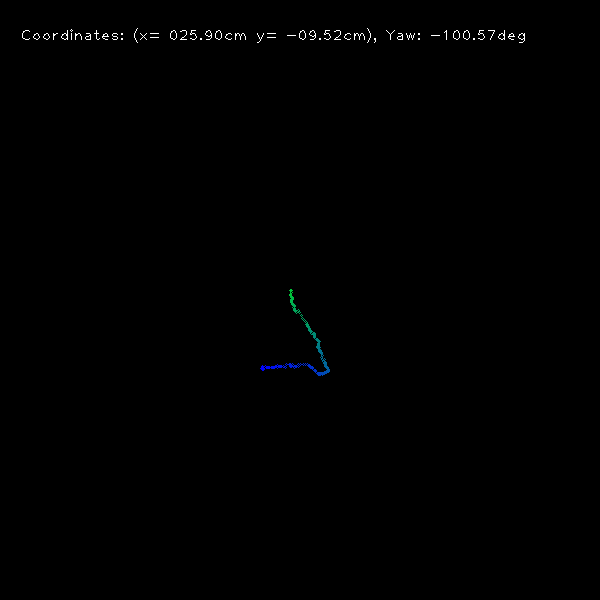  

Hier erkennt man, welchen Unterschied die Annahme macht, dass der Roboter normalerweise nach vorne und nicht auf die Seite fährt.


## Linkskurve (lang)

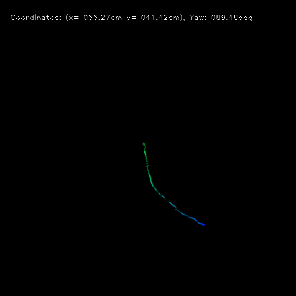

Der Schlenker wird hier wirklich erkannt. Die reine VO-Implementierung hat hier nur zu einem Wirrwar aus Punkten geführt. Die IMU-Integration hat also eine wirkliche Verbesserung der Daten bewirkt.


## Vorwärts -> 90 Grad Links -> Vorwärts -> 90 Grad Links

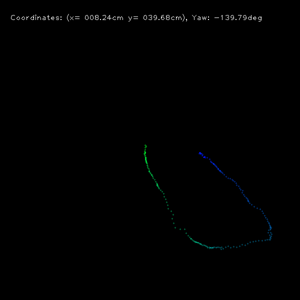

Die Serie hier wird ziemlich gut erkannt, obwohl die Entfernungen zwischenzeitlich stark voneinander abweichen.

Mit reiner Visual Odometry war hier nur ein Kreis zu sehen. Die VIO-Daten bilden die Realität deutlich besser ab. 

## Zu allen Bildern

Die jeweils angegebenen Entfernungen sind viel zu niedrig, weil die IMU-Daten keine akkuraten Distanzen liefern. Sie geben insgesamt eher eine Einschätzung "Habe ich mich bewegt? Wenn ja, wie stark?".


# 6 - Fazit

Visual Inertial Odometry ist natürlich nicht die praktikabelste Methode für die Lokalisation des Puzzlebots. Der hat Wheel Encoder, bei denen vermutlich ganz ohne Fusion schon ein besseres Ergebnis herauskommt, als hier mit viel verbrauchter Rechenleistung. Allerdings haben der Puzzlebot als Bodenroboter und die resultierenden Annahmen, die ich zur Erleichterung der Algorithmen treffen konnte, es mir ermöglicht die Konzepte von Visueller Inertieller Odometrie besser zu verstehen und selbst anzuwenden. Darunter sind beispielsweise die unterschiedlichen Kalibrierungsformen für Kamera und IMU, sowie die Computer Vision Algorithmen für die visuelle Odometrie.

**Was ist mir sonst noch aufgefallen?**
- Im gesamten Projekt musste ich mich immer wieder in viele Konzepte einlesen, nur um sie dann im Endeffekt nicht zu nutzen. Das hat mir einen weiten Themenüberblick gegeben, aber auch zu viel nicht direkt für das Projekt genutzte Zeit geführt.
- Richtiges, pures Inertial Dead Reckoning ist ein ungelöstes Problem. Es gibt ein paar Implementierungen, die es kurzzeitig schaffen, wie [hier](https://www.youtube.com/watch?v=htoBvSq8jLA) (leider ohne angefügten Code) aber das sind wirklich Ausnahmen.

# 7 - Future Work

Eigentlich hatte ich geplant das System live auf dem Roboter zum Laufen zu kriegen. Im Laufe des Projekts hat sich aber herauskristallisiert, dass das zeitlich - aufgrund der Startschwierigkeiten und der Tatsache, dass ich keinen Teampartner habe - nicht mehr möglich ist. Für eine Vollendung dieses Ziels sind allerdings jetzt alle Grundlagen geschaffen. Es fehlen aber noch ein paar Komponenten.

- Threaded Skript zur Steuerung des Roboters aus der Ferne
- OpenCV-Funktionen auf die Grafikeinheit des Jetsons umlagern. Eventuell ist OpenCV im Puzzlebot Image schon richtig installiert, falls nicht ist [hier](https://www.youtube.com/watch?v=art0-99fFa8) ein Tutorial dafür. 
- Visual-Inertial-Odometry-Objekt in den Grundstock des [Data Gathering Skripts](./code/visual_inertial_odometry/data_gathering.py) einbauen.

Eine weitere Verbesserung der Funktionalität wäre vermutlich durch eine bessere Kamera möglich. Die Raspi Cam v2 ist leider nicht sehr lichtstark, was - wie schon erwähnt - in Innenbereichen oft zu verwackelten Bildern führt.

# 8 - Andere Ansätze

Ein Raffinierterer Ansatz für Visual Inertial Odometry nutzt Multi State Constraint Kalman Filter. [Dieses Github Repository](https://github.com/rpng/open_vins) implementiert diesen Ansatz. Es wäre zwar vermutlich ein eigenes Projekt diesen Code auch für den Puzzlebot anzupassen, aber dabei lernt man vermutlich eher Interfaces aufeinanderzuschieben und arbeitet sich nicht tiefer in die dahinterliegende Datenfusion ein.